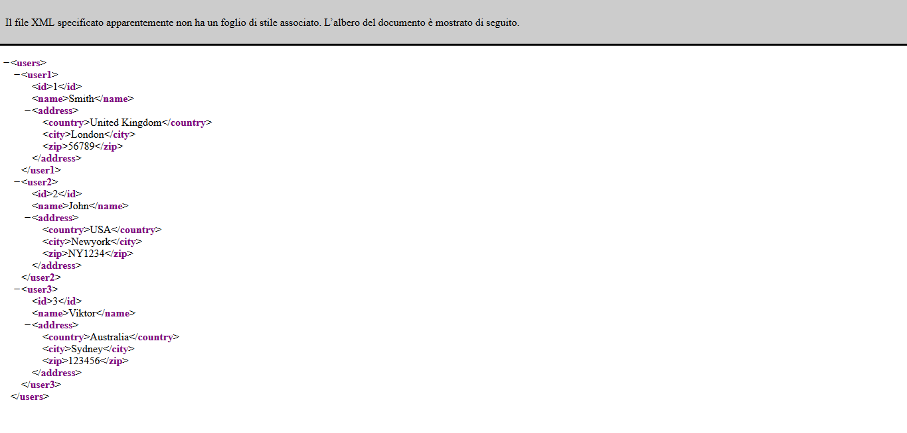
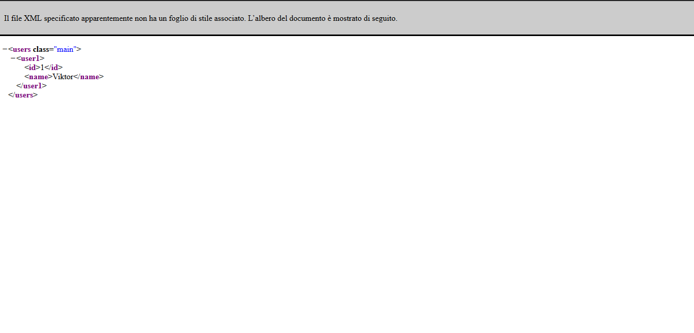
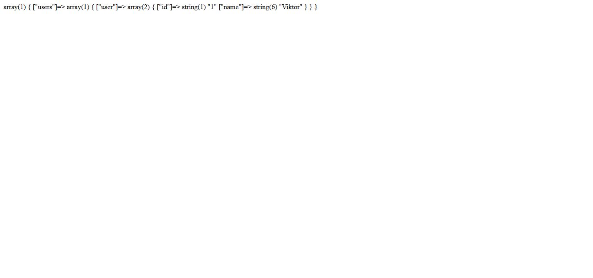

# Documentation
```
class Tag {
    /*properties*/
    string name;
    string innerText;
    array attributes = []; //attribute[name => value]
    Tag parent;
    Tag childs; //array of tag

    /*methods*/
    __construct(string name, string innerText = '', array attributes = [], Tag parent = null, Tag childs = null) :void
    setName(string name) :void
    getName() :string
    setInnerText(innerText) :void
    getInnerText() :string
    setAttribute(string name, string value) :void
    getAttribute() :array
    setParent(Tag parent) :void
    getParent() :Tag
    setChild(Tag child) :void
    getChilds() :array of Tag
}

class XML extends Tag{
    /*properties*/
    string version;
    string encoding;
    Tag root;

    /*methods*/
    __construct(string version = '1.0', string encoding = 'utf-8' ) :void
    setVersion(string version) :void
    getVersion() :string
    setEncoding(string encoding) :void
    getEncoding() :string
    setRoot(string name, string innerText = '', array attributes = [], Tag parent = null, Tag child = null) :void
    getRoot() :Tag
    createTag(string name, string innerText = '', array attributes = [], Tag parent = null, Tag child = null) :Tag
    getXML_string() :string
    getXML_string_from_array(array dataArray) :string
    getArray_from_XML_from_XML_OBJ(XML Tree) :array
    getArray_from_XML() :array
    createXML_file_from_array(array dataArray, string fileName = 'xmlFile') :boolean
    createXML_file_from_XML_OBJ(string fileName = 'xmlfile') :boolean
    createXML_file_from_XMLstring(string XMLstring, string fileName = 'xmlfile') :boolean
}
```

# How to use

To use this class in your project you will need to include it.
```code
include('xml.php');
```

# Examples to use

## Example 1

```
$xml = new XML('1.0', 'utf-8');
$users_array = array(
  "users" => array(
      'user1' => array(
          "id" => 1,
          "name" => "Smith",
          "address" => array(
              "country" => "United Kingdom",
              "city" => "London",
              "zip" => 56789,
          )
      ),
      'user2' => array(
          "id" => 2,
          "name" => "John",
          "address" => array(
              "country" => "USA",
              "city" => "Newyork",
              "zip" => "NY1234",
          ) 
      ),
      'user3' => array(
          "id" => 3,
          "name" => "Viktor",
          "address" => array(
              "country" => "Australia",
              "city" => "Sydney",
              "zip" => 123456,
          ) 
      ),
  )
);

header('Content-Type: text/xml');
echo $xml->getXML_string_from_array($users_array);
```


## Example 2

```
$xml = new XML('1.0', 'utf-8');
$xml->setRoot('users', '', ['class' => 'main']);
$user1 = $xml->createTag('user1');
$id = $xml->createTag('id', '1', [], $user1);
$name = $xml->createTag('name', 'Viktor', [], $user1);
header('Content-Type: text/xml');
echo $xml->getXML_string();
```


## Example 3

```
$xml = new XML('1.0', 'utf-8');
$xml->setRoot('users', '', ['class' => 'main']);
$user1 = $xml->createTag('user');
$id = $xml->createTag('id', '1', [], $user1);
$name = $xml->createTag('name', 'Viktor', [], $user1);
$xml->createXML_file_from_XML_OBJ();
```

Check out on current project directory the file that was created.


Check out if the parameter passed is really a string and try again

## Example 4

```
$xml = new XML('1.0', 'utf-8');
$users_array = array(
  "users" => array(
      'user1' => array(
          "id" => 1,
          "name" => "Smith",
          "address" => array(
              "country" => "United Kingdom",
              "city" => "London",
              "zip" => 56789,
          )
      ),
      'user2' => array(
          "id" => 2,
          "name" => "John",
          "address" => array(
              "country" => "USA",
              "city" => "Newyork",
              "zip" => "NY1234",
          ) 
      ),
      'user3' => array(
          "id" => 3,
          "name" => "Viktor",
          "address" => array(
              "country" => "Australia",
              "city" => "Sydney",
              "zip" => 123456,
          ) 
      ),
  )
);
$xml->createXML_file_from_array($users_array);
```

Check out on current project directory the file that was created.


Check out if the parameter passed is really a string and try again

## Example 5

```
$xml = new XML('1.0', 'utf-8');
$xml->setRoot('users', '', ['class' => 'main']);
$user1 = $xml->createTag('user1');
$id = $xml->createTag('id', '1', [], $user1);
$name = $xml->createTag('name', 'Viktor', [], $user1);
$xml->createXML_file_from_XMLstring($xml->getXML_string());
```

Check out on current project directory the file that was created.


Check out if the parameter passed is really a string and try again

## Example 6

```
$xml = new XML('1.0', 'utf-8');
$xml->setRoot('users');
$user1 = $xml->createTag('user');
$id = $xml->createTag('id', '1', [], $user1);
$name = $xml->createTag('name', 'Viktor', [], $user1);
var_dump($xml->getArray_from_XML());
```

